# Ford UI Design System Application

## Metadata

- **Name**: Ford UI Design System Application
- **Type**: Capability
- **System**: DSO Progress Demos
- **Component**: UI Design & Branding
- **ID**: CAP-129485
- **Approval**: Approved
- **Owner**: Product Team
- **Status**: Implemented
- **Priority**: High
- **Analysis Review**: Not Required

## Technical Overview
### Purpose
Apply Ford Motor Company's official design system standards to the DSO Progress Demos application, ensuring brand consistency, professional appearance, and adherence to Material Design principles with Ford's signature blue color palette.

## Enablers

| Enabler ID |
|------------|
| ENB-864819 |
| ENB-865096 |
| ENB-865044 |
| ENB-865014 |

## Dependencies

### Internal Upstream Dependency

| Capability ID | Description |
|---------------|-------------|
| | |

### Internal Downstream Impact

| Capability ID | Description |
|---------------|-------------|
| CAP-555521 | Demo Record Management - Consumes Ford design system for consistent styling |

### External Dependencies

**External Upstream Dependencies**: None identified.

**External Downstream Impact**: None identified.

## Technical Specifications

### Capability Dependency Flow Diagram

```mermaid
flowchart TD
    %% Current Capability
    CURRENT["CAP-129485<br/>Ford UI Design System<br/>Visual Standards & Branding<br/>🎨"]

    %% External Dependencies
    EXT1["Ford Brand Guidelines<br/>Official Standards<br/>🌐"]
    EXT2["Google Fonts<br/>Roboto Font Family<br/>🔤"]
    EXT3["Material Design<br/>Design Principles<br/>📐"]

    %% Internal Downstream
    INT1["CAP-555521<br/>Demo Record Management<br/>Consumes Design System<br/>📋"]

    %% Dependencies Flow
    EXT1 --> CURRENT
    EXT2 --> CURRENT
    EXT3 --> CURRENT
    CURRENT --> INT1

    %% Styling
    classDef current fill:#e3f2fd,stroke:#1976d2,stroke-width:3px
    classDef internal fill:#e8f5e8,stroke:#388e3c,stroke-width:2px
    classDef external fill:#f3e5f5,stroke:#7b1fa2,stroke-width:2px

    class CURRENT current
    class INT1 internal
    class EXT1,EXT2,EXT3 external

    %% Capability Grouping
    subgraph ORG1 ["DSO Progress Demos System"]
        subgraph DOMAIN1 ["Design System Domain"]
            CURRENT
        end
        subgraph DOMAIN2 ["Application Domain"]
            INT1
        end
    end

    subgraph ORG2 ["External Dependencies"]
        EXT1
        EXT2
        EXT3
    end
```

### Business Value
- **Primary Stakeholders**: Development team, UX designers, brand management, end users
- **Business Problem Solved**: Ensures consistent brand identity across all user touchpoints, maintains professional appearance aligned with Ford's corporate standards
- **Key Metrics**: Design system adoption rate, visual consistency score, brand compliance percentage

### Success Criteria
- All UI components follow Ford color palette specifications
- Typography matches Ford/Roboto standards with proper hierarchy
- Responsive design works across desktop, tablet, and mobile devices
- Design system is documented and reusable across future projects
- Accessibility standards (WCAG AA) are met

### Risks and Assumptions
**Assumptions:**
- Ford brand guidelines remain stable and accessible
- Google Fonts CDN availability is reliable
- Material Design principles align with Ford's brand identity
- Browser support for modern CSS features is adequate

**Risks:**
- Brand guideline changes may require significant rework
- Performance impact from loading external fonts
- Browser compatibility issues with advanced CSS features
- Maintaining design consistency as application grows

