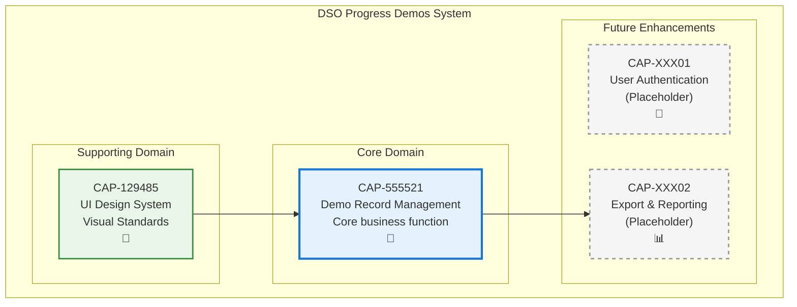

# Demo Record Management

## Metadata
- **Name**: Demo Record Management
- **Type**: Capability
- **System**: DSO Progress Demos
- **Component**: Core Application
- **ID**: CAP-555521
- **Owner**: Product Team
- **Status**: Implemented
- **Approval**: Approved
- **Priority**: High
- **Analysis Review**: Not Required

## Technical Overview
### Purpose
Provides the ability to track, store, and manage demonstration records for the DSO (Digital Sales Office) team. This capability allows users to record demo sessions with essential information including date, demo name, and presenter.

## Enablers
| ID | Description |
|----|-------------|
| ENB-861546 | Demo Form Input Handler - Provides HTML form interface for capturing demo information |
| ENB-861730 | Demo Data Storage - Manages storage and retrieval of demo records |
| ENB-861715 | Demo Records Table Display - Displays demo records in structured table format |

## Dependencies

### Internal Upstream Dependency

| Capability ID | Description |
|---------------|-------------|
| CAP-129485 | UI Design System (Ford) - Provides consistent styling and branding |

### Internal Downstream Impact

| Capability ID | Description |
|---------------|-------------|
| | None currently identified |

## Technical Specifications

### Capability Dependency Flow Diagram

### Business Value
- **Primary Users**: DSO team members, sales managers
- **Business Problem Solved**: Centralized tracking of demonstration activities and presenter accountability
- **Key Metrics**: Number of demos tracked, demo frequency per presenter, historical demo records

### Success Criteria
- Users can successfully add new demo records via form submission
- All demo records are displayed in a clear, tabular format
- Data persists across user sessions
- Form validation ensures data quality

### Risks and Assumptions
**Assumptions:**
- Users have basic web browser access
- Demo records don't require complex relationships or dependencies
- Simple chronological ordering is sufficient

**Risks:**
- Current implementation lacks data persistence (static HTML)
- No user authentication or access control
- Limited scalability for large datasets
