# Demo Form Input Handler

## Metadata
- **Name**: Demo Form Input Handler
- **Type**: Enabler
- **ID**: ENB-861546
- **Capability ID**: CAP-555521
- **Owner**: Product Team
- **Status**: Implemented
- **Approval**: Approved
- **Priority**: High
- **Analysis Review**: Not Required
- **Code Review**: Not Required

## Technical Overview
### Purpose
Provides HTML form interface for capturing demo record information including date selection, demo name text input, and presenter name text input.

## Functional Requirements
| ID | Name | Requirement | Status | Priority | Approval |
|----|-------------|--------|----------|----------|----------|
| FR-861547 | Date Input Field | Form must include a date input field for selecting the demo date | Implemented | High | Approved |
| FR-861548 | Demo Name Input Field | Form must include a text input field for entering the demo name | Implemented | High | Approved |
| FR-861549 | Presenter Name Input Field | Form must include a text input field for entering the presenter's name | Implemented | High | Approved |
| FR-861550 | Form Submission Button | Form must include a submit button to save the demo record | Implemented | High | Approved |

## Non-Functional Requirements
| ID | Name | Requirement | Type | Status | Priority | Approval |
|----|-------------|--------|----------|----------|----------|----------|
| NFR-861551 | Form Accessibility | Form fields must have proper labels for screen reader accessibility | Usability | Implemented | Medium | Approved |
| NFR-861552 | Input Validation | Form should provide basic HTML5 validation for required fields | Usability | Partially Implemented | Medium | Approved |

## Technical Specifications

### Enabler Dependency Flow Diagram

```mermaid
flowchart TD
    ENB_861546["ENB-861546<br/>Demo Form Input Handler<br/>📝"]

    ENB_861730["ENB-861730<br/>Demo Data Storage<br/>💾"]

    CAP_129485["CAP-129485<br/>Ford Design System<br/>🎨"]

    %% Dependencies
    CAP_129485 --> ENB_861546
    ENB_861546 --> ENB_861730

    classDef enabler fill:#e3f2fd,stroke:#1976d2,stroke-width:2px
    classDef capability fill:#e8f5e8,stroke:#388e3c,stroke-width:2px

    class ENB_861546,ENB_861730 enabler
    class CAP_129485 capability
```

### API Technical Specifications
| API Type | Operation | Channel / Endpoint | Description | Request / Publish Payload | Response / Subscribe Data |
|----------|-----------|---------------------|-------------|----------------------------|----------------------------|
| Form | Submit | HTML Form POST | Submits new demo record data | `{date: string, demoName: string, demoPerson: string}` | Success/Error response |

### Data Models

### Class Diagrams

### Sequence Diagrams

## External Dependencies
- HTML5 date input type support in browser
- Form element and input validation APIs

## Testing Strategy
### Unit Tests
- Validate form field rendering
- Test input validation logic
- Test form submission handler
- Test form clearing functionality

### Integration Tests
- Test form submission to data storage
- Verify data flows to table display after submission

### Manual Testing
- Cross-browser testing (Chrome, Firefox, Safari, Edge)
- Mobile responsive testing
- Accessibility testing with screen readers
