# Demo Records Table Display

## Metadata
- **Name**: Demo Records Table Display
- **Type**: Enabler
- **ID**: ENB-861715
- **Capability ID**: CAP-555521
- **Owner**: Product Team
- **Status**: Implemented
- **Approval**: Approved
- **Priority**: High
- **Analysis Review**: Not Required
- **Code Review**: Not Required

## Technical Overview
### Purpose
Displays demo records in a structured HTML table format with columns for date, demo name, and presenter name. Provides clear visual presentation of historical demo data.

## Functional Requirements
| ID | Name | Requirement | Status | Priority | Approval |
|----|-------------|--------|----------|----------|----------|
| FR-861716 | Table Structure | Display demo records in an HTML table with proper headers | Implemented | High | Approved |
| FR-861717 | Date Column | Display demo date in the first column | Implemented | High | Approved |
| FR-861718 | Demo Name Column | Display demo name in the second column | Implemented | High | Approved |
| FR-861719 | Presenter Column | Display presenter name in the third column | Implemented | High | Approved |
| FR-861720 | Chronological Ordering | Display records in chronological order by date | Implemented | Medium | Approved |

## Non-Functional Requirements
| ID | Name | Requirement | Type | Status | Priority | Approval |
|----|-------------|--------|----------|----------|----------|----------|
| NFR-861721 | Responsive Design | Table must be responsive and readable on mobile devices | Usability | Not Implemented | High | Approved |
| NFR-861722 | Visual Hierarchy | Table styling must match Ford Design System standards | Usability | Partially Implemented | High | Approved |
| NFR-861723 | Readability | Text must be legible with proper contrast ratios | Accessibility | Implemented | High | Approved |
| NFR-861724 | Performance | Table rendering should handle up to 100 records without lag | Performance | Implemented | Medium | Approved |

## Technical Specifications

### Enabler Dependency Flow Diagram

```mermaid
flowchart TD
    ENB_861715["ENB-861715<br/>Demo Records Table Display<br/>📋"]

    ENB_861730["ENB-861730<br/>Demo Data Storage<br/>💾"]

    CAP_129485["CAP-129485<br/>Ford Design System<br/>🎨"]

    USER["End User<br/>👤"]

    %% Dependencies
    ENB_861730 --> ENB_861715
    CAP_129485 --> ENB_861715
    ENB_861715 --> USER

    classDef enabler fill:#e3f2fd,stroke:#1976d2,stroke-width:2px
    classDef capability fill:#e8f5e8,stroke:#388e3c,stroke-width:2px
    classDef user fill:#fff3cd,stroke:#ffc107,stroke-width:2px

    class ENB_861715,ENB_861730 enabler
    class CAP_129485 capability
    class USER user
```

### Data Models

### Class Diagrams

### Sequence Diagrams

### Dataflow Diagrams

### State Diagrams

## API Technical Specifications
| API Type | Operation | Channel / Endpoint | Description | Request / Publish Payload | Response / Subscribe Data |
|----------|-----------|---------------------|-------------|----------------------------|----------------------------|
| DOM | Render | N/A | Renders table in DOM | Array of DemoRecord objects | HTML Table Element |
| Event | onDataChange | Event Listener | Listens for data updates | N/A | Triggers re-render |

## External Dependencies
- Ford Design System CSS (from CAP-129485)
- HTML5 table elements
- Browser DOM APIs

## Testing Strategy
### Unit Tests
- Test table HTML generation
- Test row rendering with sample data
- Test empty state display
- Test sorting functionality
- Test Ford Design System class application

### Visual Regression Tests
- Compare rendered table against design mockups
- Test responsive breakpoints
- Test typography and spacing
- Test color scheme compliance with Ford standards

### Integration Tests
- Test data flow from storage to display
- Test table updates when data changes
- Test interaction with form submission

### Accessibility Tests
- Test screen reader compatibility
- Test keyboard navigation through table
- Test color contrast ratios (WCAG AA compliance)
- Test table semantic HTML structure

### Performance Tests
- Test rendering time with 10, 50, 100, 500 records
- Test scroll performance with large datasets
- Test memory usage during render

## Technical Notes
### Current Implementation
The current static HTML implementation includes:
- Basic HTML5 table structure (`<table>`, `<thead>`, `<tbody>`, `<tr>`, `<td>`)
- Hardcoded sample data (12 demo records)
- Minimal inline styling
- No Ford Design System styling applied

### Ford Design System Integration
To be implemented based on CAP-129485:
- Apply Ford blue color palette (#081534, #133A7C, #2A6BAC, #47A8E5)
- Use Roboto font family
- Apply elevation and shadow styling
- Implement responsive grid layout
- Add hover states and interactions
- Apply Material Design principles

### Future Enhancements
1. **Sorting & Filtering**: Add column header click-to-sort functionality
2. **Pagination**: Implement pagination for large datasets
3. **Search**: Add search/filter capability
4. **Export**: Add CSV/PDF export functionality
5. **Row Actions**: Add edit/delete buttons per row
6. **Responsive Design**: Implement mobile-friendly card view
7. **Virtualization**: Implement virtual scrolling for large datasets
