# Demo Data Storage

## Metadata
- **Name**: Demo Data Storage
- **Type**: Enabler
- **ID**: ENB-861730
- **Capability ID**: CAP-555521
- **Owner**: Product Team
- **Status**: Implemented
- **Approval**: Approved
- **Priority**: High
- **Analysis Review**: Not Required
- **Code Review**: Not Required

## Technical Overview
### Purpose
Manages the storage and retrieval of demo record data. Currently implemented as static HTML table data, with future capability to support dynamic client-side or server-side persistence.

## Functional Requirements
| ID | Name | Requirement | Status | Priority | Approval |
|----|-------------|--------|----------|----------|----------|
| FR-861731 | Store Demo Records | System must maintain a collection of demo records | Implemented | High | Approved |
| FR-861732 | Retrieve All Records | System must provide access to all stored demo records | Implemented | High | Approved |
| FR-861733 | Add New Record | System must support adding new demo records to the collection | Partially Implemented | High | Approved |

## Non-Functional Requirements
| ID | Name | Requirement | Type | Status | Priority | Approval |
|----|-------------|--------|----------|----------|----------|----------|
| NFR-861734 | Data Persistence | Data should persist between user sessions | Reliability | Not Implemented | High | Approved |
| NFR-861735 | Data Integrity | Stored data must maintain accuracy and consistency | Reliability | Implemented | High | Approved |
| NFR-861736 | Performance | Data retrieval should be instantaneous for typical dataset sizes | Performance | Implemented | Medium | Approved |

## Technical Specifications

### Enabler Dependency Flow Diagram

```mermaid
flowchart TD
    ENB_861730["ENB-861730<br/>Demo Data Storage<br/>💾"]

    ENB_861546["ENB-861546<br/>Demo Form Input Handler<br/>📝"]

    ENB_861715["ENB-861715<br/>Demo Records Table Display<br/>📋"]

    FUTURE_DB["Future: Database Service<br/>(Placeholder)<br/>🗄️"]

    %% Dependencies
    ENB_861546 --> ENB_861730
    ENB_861730 --> ENB_861715
    ENB_861730 -.-> FUTURE_DB

    classDef enabler fill:#e3f2fd,stroke:#1976d2,stroke-width:2px
    classDef future fill:#f5f5f5,stroke:#999999,stroke-width:2px,stroke-dasharray: 5 5

    class ENB_861730,ENB_861546,ENB_861715 enabler
    class FUTURE_DB future
```

### Data Models

### Class Diagrams

### Sequence Diagrams

### State Diagrams

## External Dependencies
- **Current**: None (static HTML implementation)
- **Future**:
  - Browser localStorage API for client-side persistence
  - Backend REST API for server-side persistence
  - Database service (PostgreSQL, MongoDB, etc.)

## Testing Strategy
### Unit Tests
- Test data structure creation and validation
- Test add/retrieve/update/delete operations
- Test data integrity checks
- Test edge cases (empty records, duplicate data)

### Integration Tests
- Test interaction with form input handler
- Test interaction with table display component
- Test data flow through complete add-record workflow

### Performance Tests
- Test retrieval speed with 100, 1000, 10000 records
- Test memory usage with large datasets
- Test concurrent access scenarios (future multi-user support)

### Data Validation Tests
- Test required field validation
- Test date format validation
- Test string length limits
- Test special character handling

## Technical Notes
### Current Implementation
The current implementation uses static HTML table rows embedded in the page. This approach:
- ✅ Simple and functional for prototyping
- ✅ No server dependencies
- ❌ No data persistence
- ❌ Cannot add/edit/delete records dynamically

### Future Enhancement Path
1. **Phase 1**: Implement client-side JavaScript storage using localStorage
2. **Phase 2**: Add backend API with RESTful endpoints
3. **Phase 3**: Implement database persistence (PostgreSQL/MongoDB)
4. **Phase 4**: Add data export/import capabilities
5. **Phase 5**: Implement real-time synchronization for multi-user scenarios
