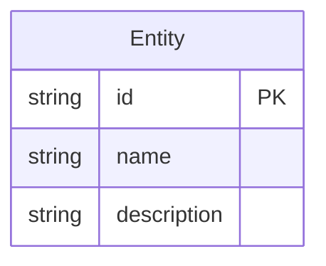
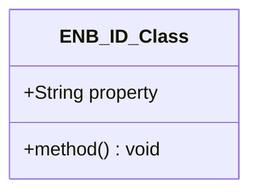
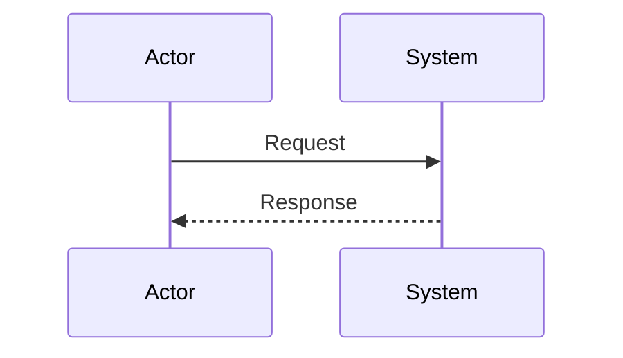
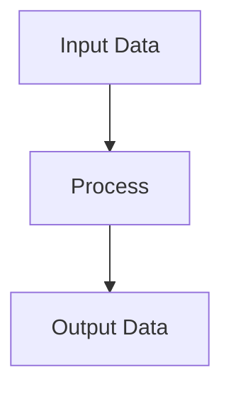
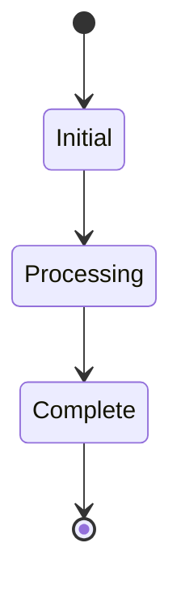

# Weather Simulator

## Metadata

- **Name**: Weather Simulator
- **Type**: Enabler
- **ID**: ENB-174293
- **Approval**: Approved
- **Capability ID**: CAP-268566
- **Owner**: Product Team
- **Status**: Ready for Design
- **Priority**: High
- **Analysis Review**: Required
- **Code Review**: Required

## Technical Overview
### Purpose
Simulate weather through the four seasons

## Functional Requirements

| ID | Name | Requirement | Priority | Status | Approval |
|----|------|-------------|----------|--------|----------|
| FR-871883 | Four seasons | Must simulate weather conditions throughout the four seasons | Must Have | Implemented | Approved |
| FR-707188 | Timeline | Must simulate four seasons in 1 minute | Must Have | Implemented | Approved |
| FR-616889 | Loop and Repeat | The four season conditions must repeat and loop | Must Have | Implemented | Approved |

## Non-Functional Requirements

| ID | Name | Type | Requirement | Priority | Status | Approval |
|----|------|------|-------------|----------|--------|----------|
| | | | | | | |

## Dependencies

### Internal Upstream Dependency

| Enabler ID | Description |
|------------|-------------|
| | |

### Internal Downstream Impact

| Enabler ID | Description |
|------------|-------------|
| | |

### External Dependencies

**External Upstream Dependencies**: None identified.

**External Downstream Impact**: None identified.

## Technical Specifications (Template)

### Enabler Dependency Flow Diagram

```mermaid
flowchart TD
    ENB_ID["ENB-ID<br/>Enabler Name<br/>📡"]
    
    %% Add your dependency flows here
    
    classDef enabler fill:#e3f2fd,stroke:#1976d2,stroke-width:2px
    class ENB_ID enabler
```

### API Technical Specifications (if applicable)

| API Type | Operation | Channel / Endpoint | Description | Request / Publish Payload | Response / Subscribe Data |
|----------|-----------|---------------------|-------------|----------------------------|----------------------------|
| | | | | | |

### Data Models

### Class Diagrams

### Sequence Diagrams

### Dataflow Diagrams

### State Diagrams

