# Web Application

## Metadata

- **Name**: Web Application
- **Type**: Enabler
- **ID**: ENB-457798
- **Approval**: Approved
- **Capability ID**: CAP-547983
- **Owner**: Product Team
- **Status**: Ready for Design
- **Priority**: High
- **Analysis Review**: Required
- **Code Review**: Required

## Technical Overview
### Purpose
Provides a local HTML web page that displays the weather

## Functional Requirements

| ID | Name | Requirement | Priority | Status | Approval |
|----|------|-------------|----------|--------|----------|
| FR-466540 | Local HTML Web Page | Web Application must be a local HTML web page without the need for a server | Must Have | Ready for Design | Approved |
| FR-491852 | Javascript | Provide dynamic capabilities in Javascript | Must Have | Ready for Design | Approved |

## Non-Functional Requirements

| ID | Name | Type | Requirement | Priority | Status | Approval |
|----|------|------|-------------|----------|--------|----------|
| NFR-XXXXXX | [Name] | [Type] | [Requirement Description] | [Priority] | [Status] | [Approval] |

## Dependencies

### Internal Upstream Dependency

| Enabler ID | Description |
|------------|-------------|
| | |

### Internal Downstream Impact

| Enabler ID | Description |
|------------|-------------|
| | |

### External Dependencies

**External Upstream Dependencies**: None identified.

**External Downstream Impact**: None identified.

## Technical Specifications (Template)

### Enabler Dependency Flow Diagram

```mermaid
flowchart TD
    ENB_ID["ENB-ID<br/>Enabler Name<br/>📡"]
    
    %% Add your dependency flows here
    
    classDef enabler fill:#e3f2fd,stroke:#1976d2,stroke-width:2px
    class ENB_ID enabler
```

### API Technical Specifications (if applicable)

| API Type | Operation | Channel / Endpoint | Description | Request / Publish Payload | Response / Subscribe Data |
|----------|-----------|---------------------|-------------|----------------------------|----------------------------|
| | | | | | |

### Data Models

### Class Diagrams

### Sequence Diagrams

### Dataflow Diagrams

### State Diagrams

