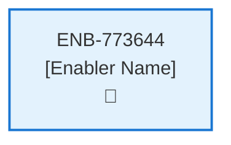
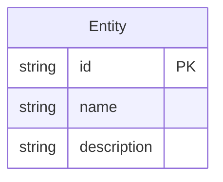
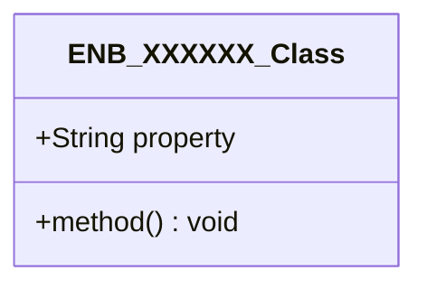
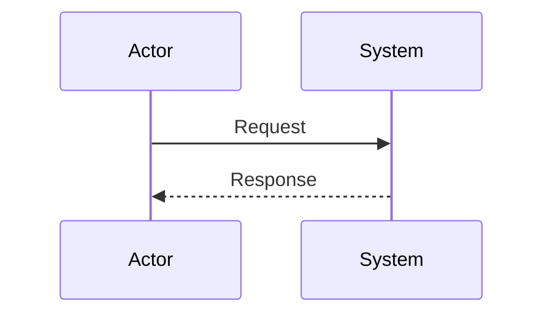
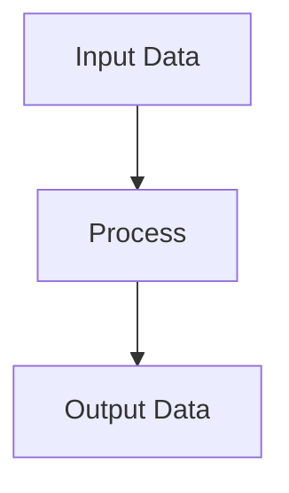
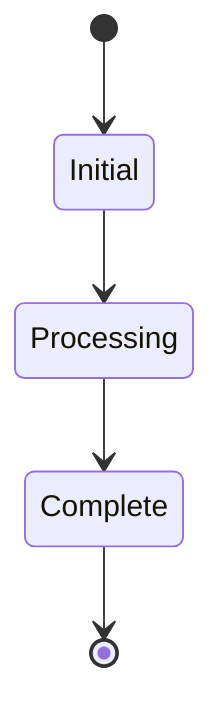

# Weather Simulator

## Metadata

- **Name**: Weather Simulator
- **Type**: Enabler
- **ID**: ENB-773644
- **Approval**: Approved
- **Capability ID**: CAP-597263
- **Owner**: Product Team
- **Status**: Ready for Design
- **Priority**: High
- **Analysis Review**: Required
- **Code Review**: Required

## Technical Overview
### Purpose
A Weather Simulator that can simulate, temperature, wind, pressure and sky conditions

## Functional Requirements

| ID | Name | Requirement | Priority | Status | Approval |
|----|------|-------------|----------|--------|----------|
| FR-119946 | Simulate Weather Readings | Simulate the following weather conditions: current temperature, wind speed, wind direction, precipitation rate, pressure and sky condition. | Must Have | Ready for Design | Approved |
| FR-191698 | Update Frequency | Update the weather readings every 1 second | Must Have | Ready for Design | Approved |
| FR-245447 | Simulated Seasons | Simulate all four weather seasons | Must Have | Ready for Design | Approved |
| FR-663644 | Weather Season Timeline | Simulate all four weather seasons within 30 seconds | Must Have | Ready for Design | Approved |

## Non-Functional Requirements

| ID | Name | Type | Requirement | Priority | Status | Approval |
|----|------|------|-------------|----------|--------|----------|
| | | | | | | |

## Dependencies

### Internal Upstream Dependency

| Enabler ID | Description |
|------------|-------------|
| | |

### Internal Downstream Impact

| Enabler ID | Description |
|------------|-------------|
| | |

### External Dependencies

**External Upstream Dependencies**: None identified.

**External Downstream Impact**: None identified.

## Technical Specifications (Template)

### Enabler Dependency Flow Diagram

### API Technical Specifications (if applicable)

| API Type | Operation | Channel / Endpoint | Description | Request / Publish Payload | Response / Subscribe Data |
|----------|-----------|---------------------|-------------|----------------------------|----------------------------|
| | | | | | |

### Data Models

### Class Diagrams

### Sequence Diagrams

### Dataflow Diagrams

### State Diagrams

