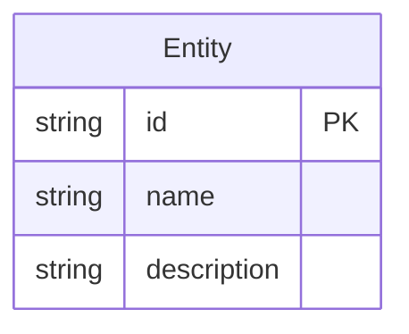
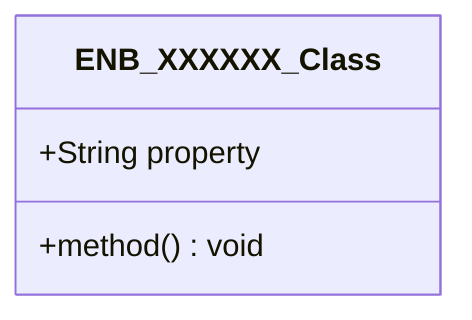
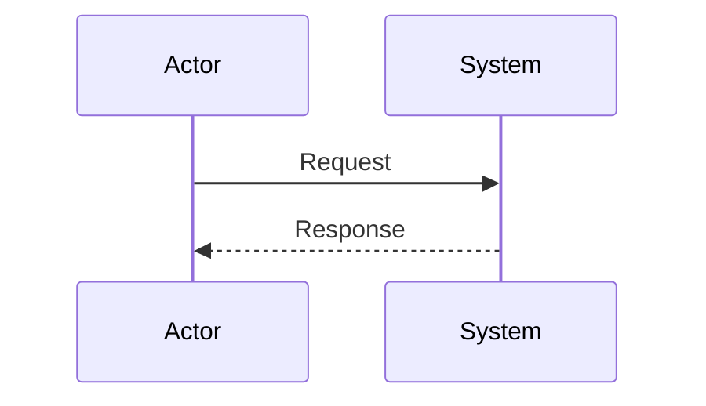
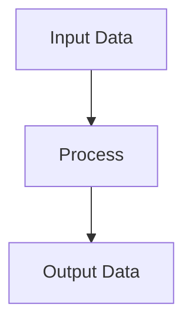
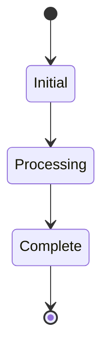

# Weather Sensor Driver MQTT  Port

## Metadata

- **Name**: Weather Sensor Driver MQTT  Port
- **Type**: Enabler
- **ID**: ENB-621403
- **Approval**: Approved
- **Capability ID**: CAP-955448
- **Owner**: Product Team
- **Status**: Ready for Design
- **Priority**: High
- **Analysis Review**: Required
- **Code Review**: Required

## Technical Overview
### Purpose
Provide a port adaptor to the MQTT topic to subscribe to weather sensor readings

## Functional Requirements

| ID | Name | Requirement | Priority | Status | Approval |
|----|------|-------------|----------|--------|----------|
| FR-454977 | Subscribe MQTT Weather Sensor readings MQTT Topic | Receive current temperature, wind speed, wind direction, precipitation rate, pressure and sky condition. | Must Have | Ready for Design | Approved |
| FR-901535 | MQTT Broker Configuration | MQTT Broker connection settings must be in a configuration file settable by the user. Default Value is 1883 | Must Have | Ready for Design | Approved |

## Non-Functional Requirements

| ID | Name | Type | Requirement | Priority | Status | Approval |
|----|------|------|-------------|----------|--------|----------|
| | | | | | | |

## Dependencies

### Internal Upstream Dependency

| Enabler ID | Description |
|------------|-------------|
| | |

### Internal Downstream Impact

| Enabler ID | Description |
|------------|-------------|
| | |

### External Dependencies

**External Upstream Dependencies**: None identified.

**External Downstream Impact**: None identified.

## Technical Specifications (Template)

### Enabler Dependency Flow Diagram

```mermaid
flowchart TD
    ENB_XXXXXX["ENB-621403<br/>[Enabler Name]<br/>📡"]

    %% Add your dependency flows here

    classDef enabler fill:#e3f2fd,stroke:#1976d2,stroke-width:2px
    class ENB_XXXXXX enabler
```

### API Technical Specifications (if applicable)

| API Type | Operation | Channel / Endpoint | Description | Request / Publish Payload | Response / Subscribe Data |
|----------|-----------|---------------------|-------------|----------------------------|----------------------------|
| | | | | | |

### Data Models

### Class Diagrams

### Sequence Diagrams

### Dataflow Diagrams

### State Diagrams

