# SQLite Port

## Metadata

- **Name**: SQLite Port
- **Type**: Enabler
- **ID**: ENB-100636
- **Approval**: Approved
- **Capability ID**: CAP-597588
- **Owner**: Product Team
- **Status**: Ready for Design
- **Priority**: High
- **Analysis Review**: Required
- **Code Review**: Not Required

## Technical Overview
### Purpose
Provides an SQLite Port adaptor to store values to an SQLite Database

## Functional Requirements

| ID | Name | Requirement | Priority | Status | Approval |
|----|------|-------------|----------|--------|----------|
| FR-XXXXXX | [Name] | [Requirement Description] | [Priority] | [Status] | [Approval] |

## Non-Functional Requirements

| ID | Name | Type | Requirement | Priority | Status | Approval |
|----|------|------|-------------|----------|--------|----------|
| NFR-XXXXXX | [Name] | [Type] | [Requirement Description] | [Priority] | [Status] | [Approval] |

## Dependencies

### Internal Upstream Dependency

| Enabler ID | Description |
|------------|-------------|
| | |

### Internal Downstream Impact

| Enabler ID | Description |
|------------|-------------|
| | |

### External Dependencies

**External Upstream Dependencies**: None identified.

**External Downstream Impact**: None identified.

## Technical Specifications (Template)

### Enabler Dependency Flow Diagram

```mermaid
flowchart TD
    ENB_XXXXXX["ENB-100636<br/>SQLite Port<br/>📡"]

    %% Add your dependency flows here

    classDef enabler fill:#e3f2fd,stroke:#1976d2,stroke-width:2px
    class ENB_XXXXXX enabler
```

### API Technical Specifications (if applicable)

| API Type | Operation | Channel / Endpoint | Description | Request / Publish Payload | Response / Subscribe Data |
|----------|-----------|---------------------|-------------|----------------------------|----------------------------|
| | | | | | |

### Data Models

### Class Diagrams

### Sequence Diagrams

### Dataflow Diagrams

### State Diagrams

