# Document Lifecycle Management

## Metadata
- **Name**: Document Lifecycle Management
- **Type**: Capability
- **System**: Ford Anvil Core
- **Component**: Document Management
- **ID**: CAP-100234
- **Owner**: Product Team
- **Status**: Implemented
- **Approval**: Approved
- **Priority**: High
- **Analysis Review**: Not Required

## Technical Overview
### Purpose
Provides complete lifecycle management for capability and enabler documents including creation, editing, viewing, copying, and deletion with full metadata tracking, form-based editing, and markdown support.

## Enablers
| ID | Description |
|----|-------------|
| ENB-200100 | Document Editor providing dual-mode form/markdown editing interface |
| ENB-200101 | Document Viewer with real-time HTML rendering and external change detection |
| ENB-200102 | Document Copy Functionality with smart ID regeneration and requirement renumbering |
| ENB-200103 | File Management API providing backend CRUD operations for markdown documents |

## Dependencies

### Internal Upstream Dependency

| Capability ID | Description |
|---------------|-------------|
| CAP-500678 | Template Management - Provides document templates for new document creation |
| CAP-700890 | REST API Infrastructure - Provides API endpoints for file operations |

### Internal Downstream Impact

| Capability ID | Description |
|---------------|-------------|
| CAP-200345 | Workspace Management - Uses document lifecycle operations for workspace-specific documents |
| CAP-400567 | Navigation and Discovery - Displays documents managed by this capability |

## Technical Specifications (Template)

### Capability Dependency Flow Diagram

```mermaid
flowchart TD
    CAP_100234["CAP-100234<br/>Document Lifecycle Management<br/>🎯"]

    CAP_500678["CAP-500678<br/>Template Management<br/>⚙️"]
    CAP_700890["CAP-700890<br/>REST API Infrastructure<br/>⚙️"]
    CAP_200345["CAP-200345<br/>Workspace Management<br/>📊"]
    CAP_400567["CAP-400567<br/>Navigation and Discovery<br/>🔧"]

    CAP_500678 --> CAP_100234
    CAP_700890 --> CAP_100234
    CAP_100234 --> CAP_200345
    CAP_100234 --> CAP_400567

    classDef current fill:#e3f2fd,stroke:#1976d2,stroke-width:3px
    classDef internal fill:#e8f5e8,stroke:#388e3c,stroke-width:2px

    class CAP_100234 current
    class CAP_500678,CAP_700890,CAP_200345,CAP_400567 internal

    subgraph ORG1 ["Ford Anvil Application"]
        subgraph DOMAIN1 ["Core Document Management"]
            CAP_100234
        end
        subgraph DOMAIN2 ["Supporting Capabilities"]
            CAP_500678
            CAP_700890
            CAP_200345
            CAP_400567
        end
    end
```

