# Workspace Management

## Metadata
- **Name**: Workspace Management
- **Type**: Capability
- **System**: Ford Anvil Core
- **Component**: Workspace Management
- **ID**: CAP-200345
- **Owner**: Product Team
- **Status**: Implemented
- **Approval**: Approved
- **Priority**: High
- **Analysis Review**: Not Required

## Technical Overview
### Purpose
Supports multiple independent workspaces with separate document collections and project path configurations, enabling teams to manage different products or organizational units within a single application instance.

## Enablers
| ID | Description |
|----|-------------|
| ENB-200200 | Workspace Management UI for creating, editing, and deleting workspaces |
| ENB-200201 | Workspace API Endpoints providing CRUD operations and activation |
| ENB-200202 | Workspace State Management through AppContext for global workspace tracking |
| ENB-200203 | Multi-Path Project Support enabling multiple document directories per workspace |
| ENB-200204 | Configuration Management with workspace persistence and validation |

## Dependencies

### Internal Upstream Dependency

| Capability ID | Description |
|---------------|-------------|
| CAP-700890 | REST API Infrastructure - Provides API framework for workspace operations |
| CAP-800901 | Application Configuration - Manages workspace configuration persistence |

### Internal Downstream Impact

| Capability ID | Description |
|---------------|-------------|
| CAP-100234 | Document Lifecycle Management - Operates within active workspace context |
| CAP-400567 | Navigation and Discovery - Filters documents by active workspace |

## Technical Specifications (Template)

### Capability Dependency Flow Diagram

```mermaid
flowchart TD
    CAP_200345["CAP-200345<br/>Workspace Management<br/>🎯"]

    CAP_700890["CAP-700890<br/>REST API Infrastructure<br/>⚙️"]
    CAP_800901["CAP-800901<br/>Application Configuration<br/>⚙️"]
    CAP_100234["CAP-100234<br/>Document Lifecycle Management<br/>📊"]
    CAP_400567["CAP-400567<br/>Navigation and Discovery<br/>🔧"]

    CAP_700890 --> CAP_200345
    CAP_800901 --> CAP_200345
    CAP_200345 --> CAP_100234
    CAP_200345 --> CAP_400567

    classDef current fill:#e3f2fd,stroke:#1976d2,stroke-width:3px
    classDef internal fill:#e8f5e8,stroke:#388e3c,stroke-width:2px

    class CAP_200345 current
    class CAP_700890,CAP_800901,CAP_100234,CAP_400567 internal

    subgraph ORG1 ["Ford Anvil Application"]
        subgraph DOMAIN1 ["Workspace Management"]
            CAP_200345
        end
        subgraph DOMAIN2 ["Supporting Capabilities"]
            CAP_700890
            CAP_800901
            CAP_100234
            CAP_400567
        end
    end
```

