# Real-Time Document Synchronization

## Metadata
- **Name**: Real-Time Document Synchronization
- **Type**: Capability
- **System**: Ford Anvil Core
- **Component**: Real-Time Services
- **ID**: CAP-300456
- **Owner**: Product Team
- **Status**: Implemented
- **Approval**: Approved
- **Priority**: High
- **Analysis Review**: Not Required

## Technical Overview
### Purpose
Automatically detects external file changes and synchronizes the UI in real-time through WebSocket communication, eliminating the need for manual browser refresh when documents are modified by external tools like Claude Code.

## Enablers
| ID | Description |
|----|-------------|
| ENB-200300 | WebSocket Service providing client-side connection with automatic reconnection |
| ENB-200301 | File System Watcher using chokidar for monitoring markdown file changes |
| ENB-200302 | WebSocket Server for bidirectional client-server communication |
| ENB-200303 | External Change Notifications displaying field changes in floating overlays |
| ENB-200304 | Graceful Shutdown Management for proper resource cleanup |

## Dependencies

### Internal Upstream Dependency

| Capability ID | Description |
|---------------|-------------|
| CAP-700890 | REST API Infrastructure - Provides HTTP server infrastructure for WebSocket upgrade |

### Internal Downstream Impact

| Capability ID | Description |
|---------------|-------------|
| CAP-100234 | Document Lifecycle Management - Benefits from real-time document updates |
| CAP-400567 | Navigation and Discovery - Updates navigation panel when files change |

## Technical Specifications (Template)

### Capability Dependency Flow Diagram

```mermaid
flowchart TD
    CAP_300456["CAP-300456<br/>Real-Time Document Synchronization<br/>🎯"]

    CAP_700890["CAP-700890<br/>REST API Infrastructure<br/>⚙️"]
    CAP_100234["CAP-100234<br/>Document Lifecycle Management<br/>📊"]
    CAP_400567["CAP-400567<br/>Navigation and Discovery<br/>🔧"]

    CAP_700890 --> CAP_300456
    CAP_300456 --> CAP_100234
    CAP_300456 --> CAP_400567

    classDef current fill:#e3f2fd,stroke:#1976d2,stroke-width:3px
    classDef internal fill:#e8f5e8,stroke:#388e3c,stroke-width:2px

    class CAP_300456 current
    class CAP_700890,CAP_100234,CAP_400567 internal

    subgraph ORG1 ["Ford Anvil Application"]
        subgraph DOMAIN1 ["Real-Time Services"]
            CAP_300456
        end
        subgraph DOMAIN2 ["Dependent Capabilities"]
            CAP_700890
            CAP_100234
            CAP_400567
        end
    end
```

