# Navigation and Discovery

## Metadata
- **Name**: Navigation and Discovery
- **Type**: Capability
- **System**: Ford Anvil Core
- **Component**: User Interface
- **ID**: CAP-400567
- **Owner**: Product Team
- **Status**: Implemented
- **Approval**: Approved
- **Priority**: High
- **Analysis Review**: Not Required

## Technical Overview
### Purpose
Provides intuitive hierarchical navigation for capabilities and enablers organized by system and component, with full-text global search, filtering capabilities, and document discovery features.

## Enablers
| ID | Description |
|----|-------------|
| ENB-200400 | Navigation Sidebar with expandable system/component grouping and alphabetical sorting |
| ENB-200401 | Global Search providing full-text search across capabilities, enablers, and requirements |
| ENB-200402 | Document Type Classification for automatic categorization |
| ENB-200403 | Document Scanner for recursive discovery and metadata extraction |
| ENB-200404 | Filtering System enabling capability-based enabler filtering |

## Dependencies

### Internal Upstream Dependency

| Capability ID | Description |
|---------------|-------------|
| CAP-200345 | Workspace Management - Provides active workspace context for filtering |
| CAP-700890 | REST API Infrastructure - Provides API endpoints for document listing |

### Internal Downstream Impact

| Capability ID | Description |
|---------------|-------------|
| CAP-100234 | Document Lifecycle Management - Enables document selection and navigation |

## Technical Specifications (Template)

### Capability Dependency Flow Diagram

```mermaid
flowchart TD
    CAP_400567["CAP-400567<br/>Navigation and Discovery<br/>🎯"]

    CAP_200345["CAP-200345<br/>Workspace Management<br/>⚙️"]
    CAP_700890["CAP-700890<br/>REST API Infrastructure<br/>⚙️"]
    CAP_100234["CAP-100234<br/>Document Lifecycle Management<br/>📊"]

    CAP_200345 --> CAP_400567
    CAP_700890 --> CAP_400567
    CAP_400567 --> CAP_100234

    classDef current fill:#e3f2fd,stroke:#1976d2,stroke-width:3px
    classDef internal fill:#e8f5e8,stroke:#388e3c,stroke-width:2px

    class CAP_400567 current
    class CAP_200345,CAP_700890,CAP_100234 internal

    subgraph ORG1 ["Ford Anvil Application"]
        subgraph DOMAIN1 ["Navigation"]
            CAP_400567
        end
        subgraph DOMAIN2 ["Supporting Capabilities"]
            CAP_200345
            CAP_700890
            CAP_100234
        end
    end
```

