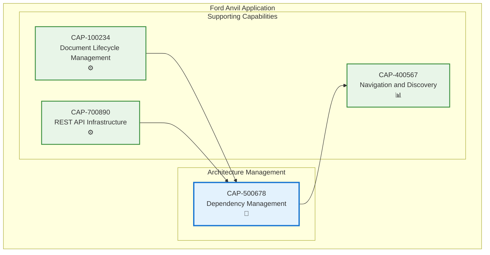

# Dependency Management

## Metadata
- **Name**: Dependency Management
- **Type**: Capability
- **System**: Ford Anvil Core
- **Component**: Architecture Management
- **ID**: CAP-500678
- **Owner**: Product Team
- **Status**: Implemented
- **Approval**: Approved
- **Priority**: High
- **Analysis Review**: Not Required

## Technical Overview
### Purpose
Tracks and visualizes upstream and downstream dependencies between capabilities and enablers, providing interactive system architecture diagrams and dependency tables for understanding component relationships.

## Enablers
| ID | Description |
|----|-------------|
| ENB-200500 | Relationship Diagram with Mermaid.js-based architecture visualization |
| ENB-200501 | Dependency Form Fields for hierarchical capability/enabler selection |
| ENB-200502 | Dependency API providing capability dependency graphs |
| ENB-200503 | Dynamic Dependency Enhancement injecting capability names into HTML tables |
| ENB-200504 | Pan and Zoom Controls for interactive diagram navigation |

## Dependencies

### Internal Upstream Dependency

| Capability ID | Description |
|---------------|-------------|
| CAP-100234 | Document Lifecycle Management - Stores dependency metadata in documents |
| CAP-700890 | REST API Infrastructure - Provides API for dependency data retrieval |

### Internal Downstream Impact

| Capability ID | Description |
|---------------|-------------|
| CAP-400567 | Navigation and Discovery - Uses dependency data for document organization |

## Technical Specifications (Template)

### Capability Dependency Flow Diagram

