# Requirements Management

## Metadata
- **Name**: Requirements Management
- **Type**: Capability
- **System**: Ford Anvil Core
- **Component**: Requirements Management
- **ID**: CAP-600789
- **Owner**: Product Team
- **Status**: Implemented
- **Approval**: Approved
- **Priority**: High
- **Analysis Review**: Not Required

## Technical Overview
### Purpose
Defines and manages functional and non-functional requirements within enablers with bulk editing capabilities for efficient status and approval transitions across multiple requirements simultaneously.

## Enablers
| ID | Description |
|----|-------------|
| ENB-200600 | Requirements Editor providing tables for FR and NFR management |
| ENB-200601 | Bulk Edit Panel with selective checkboxes and master select/deselect |
| ENB-200602 | Requirement Status Management for bulk priority, status, and approval updates |
| ENB-200603 | Requirements ID Generator for auto-incrementing FR and NFR identifiers |
| ENB-200604 | Markdown Conversion for requirement lists with consistent formatting |

## Dependencies

### Internal Upstream Dependency

| Capability ID | Description |
|---------------|-------------|
| CAP-100234 | Document Lifecycle Management - Stores requirements within enabler documents |

### Internal Downstream Impact

| Capability ID | Description |
|---------------|-------------|
| CAP-400567 | Navigation and Discovery - Makes requirements searchable in global search |

## Technical Specifications (Template)

### Capability Dependency Flow Diagram

```mermaid
flowchart TD
    CAP_600789["CAP-600789<br/>Requirements Management<br/>🎯"]

    CAP_100234["CAP-100234<br/>Document Lifecycle Management<br/>⚙️"]
    CAP_400567["CAP-400567<br/>Navigation and Discovery<br/>📊"]

    CAP_100234 --> CAP_600789
    CAP_600789 --> CAP_400567

    classDef current fill:#e3f2fd,stroke:#1976d2,stroke-width:3px
    classDef internal fill:#e8f5e8,stroke:#388e3c,stroke-width:2px

    class CAP_600789 current
    class CAP_100234,CAP_400567 internal

    subgraph ORG1 ["Ford Anvil Application"]
        subgraph DOMAIN1 ["Requirements Management"]
            CAP_600789
        end
        subgraph DOMAIN2 ["Supporting Capabilities"]
            CAP_100234
            CAP_400567
        end
    end
```

