# Template Management

## Metadata
- **Name**: Template Management
- **Type**: Capability
- **System**: Ford Anvil Core
- **Component**: Template System
- **ID**: CAP-700890
- **Owner**: Product Team
- **Status**: Implemented
- **Approval**: Approved
- **Priority**: High
- **Analysis Review**: Not Required

## Technical Overview
### Purpose
Provides document templates that auto-populate with generated unique IDs and default values, ensuring consistent document structure and metadata across all capability and enabler documents.

## Enablers
| ID | Description |
|----|-------------|
| ENB-200700 | Template API Endpoints for retrieving capability and enabler templates |
| ENB-200701 | Dynamic ID Injection auto-generating unique IDs into templates |
| ENB-200702 | Template Loading with intelligent fallback logic for document types |
| ENB-200703 | Template File Storage managing markdown template files with placeholders |

## Dependencies

### Internal Upstream Dependency

| Capability ID | Description |
|---------------|-------------|
| CAP-800901 | Application Configuration - Provides template directory configuration |

### Internal Downstream Impact

| Capability ID | Description |
|---------------|-------------|
| CAP-100234 | Document Lifecycle Management - Uses templates for new document creation |

## Technical Specifications (Template)

### Capability Dependency Flow Diagram

```mermaid
flowchart TD
    CAP_700890["CAP-700890<br/>Template Management<br/>🎯"]

    CAP_800901["CAP-800901<br/>Application Configuration<br/>⚙️"]
    CAP_100234["CAP-100234<br/>Document Lifecycle Management<br/>📊"]

    CAP_800901 --> CAP_700890
    CAP_700890 --> CAP_100234

    classDef current fill:#e3f2fd,stroke:#1976d2,stroke-width:3px
    classDef internal fill:#e8f5e8,stroke:#388e3c,stroke-width:2px

    class CAP_700890 current
    class CAP_800901,CAP_100234 internal

    subgraph ORG1 ["Ford Anvil Application"]
        subgraph DOMAIN1 ["Template System"]
            CAP_700890
        end
        subgraph DOMAIN2 ["Supporting Capabilities"]
            CAP_800901
            CAP_100234
        end
    end
```

