# Authenticate User

## Metadata

- **Name**: Authenticate User
- **Type**: Capability
- **System**: Ford Anvil Core
- **Component**: Authentication System
- **ID**: CAP-725677
- **Approval**: Approved
- **Owner**: James Reynolds
- **Status**: Ready for Design
- **Priority**: High
- **Analysis Review**: Required

## Technical Overview
### Purpose
The authentication system component will give the users the ability to be required to authenticate with their credentials before being able to access the application.  The credentials will be stored in a local database. Upon successful entry of the username and password, the user will be allowed to access the application. The authentication webpage will be shown first when the user goes to the main URL. 

## Enablers

| Enabler ID | Description |
|------------|-------------|
| ENB-300100 | Login UI Component - User interface for authentication |
| ENB-300101 | Authentication API Endpoints - Backend login/logout/verify endpoints |
| ENB-300102 | User Database Schema - SQLite schema for user credentials |
| ENB-300103 | Session Management Service - JWT-based session management |
| ENB-300104 | Protected Route Middleware - Route protection and authentication guards |
| ENB-300105 | Password Hashing Service - bcrypt password security |

## Dependencies

### Internal Upstream Dependency

| Capability ID | Description |
|---------------|-------------|
| CAP-900012 | REST API Infrastructure - Provides Express server for authentication endpoints |
| CAP-800901 | Application Configuration - Provides configuration management for auth settings |

### Internal Downstream Impact

| Capability ID | Description |
|---------------|-------------|
| CAP-100234 | Document Lifecycle Management - Will require authentication to access |
| CAP-200345 | Workspace Management - Will require authentication to access |
| CAP-400567 | Navigation and Discovery - Will require authentication to access |

### External Dependencies

**External Upstream Dependencies**: None identified.

**External Downstream Impact**: None identified.

## Technical Specifications (Template)

### Capability Dependency Flow Diagram
> **Note for AI**: When designing this section, show the direct relationships and dependencies between capabilities (NOT enablers). Focus on capability-to-capability interactions, business value flows, and how capabilities work together to deliver end-to-end business outcomes. Include:
> - **Current Capability**: The capability being defined and its role in the business value chain
> - **Internal Dependencies**: Dependencies on other capabilities within the same organizational boundary/domain
> - **External Dependencies**: Dependencies on capabilities across organizational boundaries.
> - **Business Flow**: How business value and data flows between capabilities
> - **Exclude**: Enabler-level details, technical implementation specifics, infrastructure components

```mermaid
flowchart TD
    %% Current Capability
    CAP_725677["CAP-725677<br/>Authenticate User<br/>🎯"]

    %% Internal Upstream Capabilities
    CAP_900012["CAP-900012<br/>REST API Infrastructure<br/>⚙️"]
    CAP_800901["CAP-800901<br/>Application Configuration<br/>⚙️"]

    %% Internal Downstream Capabilities
    CAP_100234["CAP-100234<br/>Document Lifecycle Management<br/>📊"]
    CAP_200345["CAP-200345<br/>Workspace Management<br/>📊"]
    CAP_400567["CAP-400567<br/>Navigation and Discovery<br/>📊"]

    %% Internal Dependencies Flow
    CAP_900012 --> CAP_725677
    CAP_800901 --> CAP_725677
    CAP_725677 --> CAP_100234
    CAP_725677 --> CAP_200345
    CAP_725677 --> CAP_400567

    %% Styling
    classDef current fill:#e3f2fd,stroke:#1976d2,stroke-width:3px
    classDef internal fill:#e8f5e8,stroke:#388e3c,stroke-width:2px

    class CAP_725677 current
    class CAP_900012,CAP_800901,CAP_100234,CAP_200345,CAP_400567 internal

    %% Capability Grouping
    subgraph ORG1 ["Ford Anvil Application"]
        subgraph DOMAIN1 ["Authentication System"]
            CAP_725677
        end
        subgraph DOMAIN2 ["Infrastructure"]
            CAP_900012
            CAP_800901
        end
        subgraph DOMAIN3 ["Protected Capabilities"]
            CAP_100234
            CAP_200345
            CAP_400567
        end
    end
```

