# Application Configuration

## Metadata
- **Name**: Application Configuration
- **Type**: Capability
- **System**: Ford Anvil Core
- **Component**: Configuration Management
- **ID**: CAP-800901
- **Owner**: Product Team
- **Status**: Implemented
- **Approval**: Approved
- **Priority**: High
- **Analysis Review**: Not Required

## Technical Overview
### Purpose
Provides centralized configuration management including workspace settings, server configuration, default values, and template paths with validation, persistence, and deep merge capabilities for factory and local overrides.

## Enablers
| ID | Description |
|----|-------------|
| ENB-200800 | Settings Interface for managing server port, defaults, and review requirements |
| ENB-200801 | Configuration API for reading and updating configuration files |
| ENB-200802 | Configuration Validation with schema validation and detailed error messages |
| ENB-200803 | Deep Merge Configuration for intelligent factory and local override merging |
| ENB-200804 | Configuration Persistence with atomic file writing and reloading |

## Dependencies

### Internal Upstream Dependency

| Capability ID | Description |
|---------------|-------------|
| CAP-900012 | REST API Infrastructure - Provides HTTP framework for configuration endpoints |

### Internal Downstream Impact

| Capability ID | Description |
|---------------|-------------|
| CAP-200345 | Workspace Management - Uses configuration for workspace persistence |
| CAP-700890 | Template Management - Uses configuration for template directory paths |
| CAP-900012 | REST API Infrastructure - Uses configuration for server port settings |

## Technical Specifications (Template)

### Capability Dependency Flow Diagram

```mermaid
flowchart TD
    CAP_800901["CAP-800901<br/>Application Configuration<br/>🎯"]

    CAP_900012["CAP-900012<br/>REST API Infrastructure<br/>⚙️"]
    CAP_200345["CAP-200345<br/>Workspace Management<br/>📊"]
    CAP_700890["CAP-700890<br/>Template Management<br/>🔧"]

    CAP_900012 --> CAP_800901
    CAP_800901 --> CAP_200345
    CAP_800901 --> CAP_700890
    CAP_800901 --> CAP_900012

    classDef current fill:#e3f2fd,stroke:#1976d2,stroke-width:3px
    classDef internal fill:#e8f5e8,stroke:#388e3c,stroke-width:2px

    class CAP_800901 current
    class CAP_900012,CAP_200345,CAP_700890 internal

    subgraph ORG1 ["Ford Anvil Application"]
        subgraph DOMAIN1 ["Configuration Management"]
            CAP_800901
        end
        subgraph DOMAIN2 ["Dependent Capabilities"]
            CAP_900012
            CAP_200345
            CAP_700890
        end
    end
```

