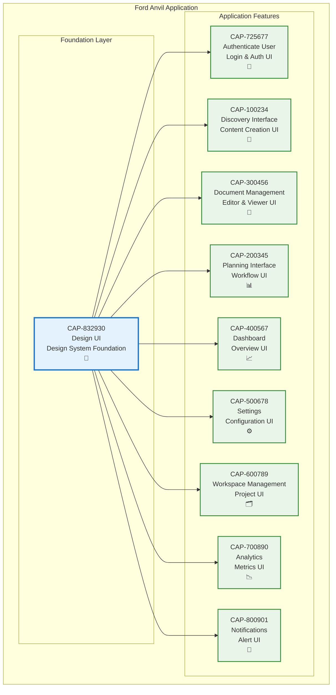

# design ui

## Metadata

- **Name**: design ui
- **Type**: Capability
- **System**: Ford Anvil Core
- **Component**: User Interface
- **ID**: CAP-832930
- **Approval**: Approved
- **Owner**: Product Team
- **Status**: Implemented
- **Priority**: High
- **Analysis Review**: Required

## Technical Overview
### Purpose
All UI elements shall adhere to the design system found at this location:
/Users/jamesreynolds/Documents/Development/Ford Anvil/anvil/specifications

## Enablers

| Enabler ID |
|------------|
| ENB-833100 |
| ENB-833101 |
| ENB-833102 |
| ENB-833103 |
| ENB-833104 |
| ENB-833105 |

## Dependencies

### Internal Upstream Dependency

| Capability ID | Description |
|---------------|-------------|
| | |

### Internal Downstream Impact

| Capability ID | Description |
|---------------|-------------|
| | |

### External Dependencies

**External Upstream Dependencies**: None identified.

**External Downstream Impact**: None identified.

## Technical Specifications

### Overview

The Design UI capability provides a comprehensive design system that ensures visual consistency, accessibility, and maintainability across the Ford Anvil application. Built on modern web standards using OKLCH color space, Tailwind CSS, and React components, this design system serves as the foundation for all user interface elements.

### Design System Architecture

The design system is composed of six key enablers working together:

1. **Color Palette System (ENB-833100)**: Semantic color tokens using OKLCH color space for light and dark themes
2. **Typography System (ENB-833101)**: Type scale with font families, sizes, weights, and line heights
3. **Spacing Scale System (ENB-833102)**: Consistent spacing for layout, margins, padding, and gaps
4. **Component Library (ENB-833103)**: Reusable React components with consistent styling
5. **Icon System (ENB-833104)**: Lucide React icon library with usage patterns
6. **Theme Management (ENB-833105)**: Light/dark mode switching with persistent preferences

### Design Tokens

**Color System**:
- Base semantic tokens: background, foreground, card, popover, primary, secondary, muted, accent, destructive
- Chart colors: 5-color palette for data visualization
- Border and input tokens for form elements
- Full OKLCH color space support for perceptually uniform colors

**Typography Scale**:
- Font family: System UI fonts with monospace fallback for code
- Heading scale: H1 (2rem) through H6 (0.875rem)
- Line heights: 1.3 for headings, 1.7 for body text
- Letter spacing: Optimized for readability

**Spacing Scale**:
- Border radius: Base radius of 0.5rem with sm/md/lg variants
- Spacing follows Tailwind's default scale (0.25rem base unit)
- Layout gaps and padding use consistent 4px grid

### Component Architecture

Components are built using:
- **React 18**: Functional components with hooks
- **TypeScript**: Full type safety
- **Tailwind CSS**: Utility-first styling with design tokens
- **CSS Variables**: Dynamic theming support
- **Accessibility**: WCAG 2.1 AA compliance

### Theme System

**Implementation**:
- CSS custom properties for dynamic theming
- Class-based theme switching (.dark selector)
- localStorage persistence for user preferences
- System preference detection via prefers-color-scheme
- Smooth theme transitions

**Theme Modes**:
- Light mode: High contrast, clean aesthetic
- Dark mode: Reduced eye strain, OLED-friendly colors

### Capability Dependency Flow Diagram

### Implementation Guidelines

**For Developers**:
1. Always use design tokens instead of hardcoded colors
2. Apply spacing scale consistently for layouts
3. Use typography scale for all text elements
4. Leverage component library for common UI patterns
5. Test components in both light and dark themes
6. Ensure WCAG 2.1 AA compliance for all interactive elements

**File Locations**:
- Color tokens: `client/src/index.css`
- Tailwind config: `client/tailwind.config.js`
- Component library: `client/src/components/`
- Theme provider: `client/src/components/ThemeProvider.tsx`

### Success Criteria

- ✓ All UI elements use design tokens
- ✓ Visual consistency across all views
- ✓ WCAG 2.1 AA accessibility compliance
- ✓ Theme switching without page reload
- ✓ Responsive design for mobile, tablet, and desktop
- ✓ Component reusability rate > 80%

