# REST API Infrastructure

## Metadata
- **Name**: REST API Infrastructure
- **Type**: Capability
- **System**: Ford Anvil Core
- **Component**: Backend Infrastructure
- **ID**: CAP-900012
- **Owner**: Product Team
- **Status**: Implemented
- **Approval**: Approved
- **Priority**: High
- **Analysis Review**: Not Required

## Technical Overview
### Purpose
Provides comprehensive REST API architecture with Express.js server, HTTP/WebSocket support, path validation, security features, and complete CRUD endpoints for all application functionality.

## Enablers
| ID | Description |
|----|-------------|
| ENB-200900 | Express Server providing HTTP framework with middleware and routing |
| ENB-200901 | File Management Endpoints for document CRUD operations |
| ENB-200902 | Workspace API Endpoints for workspace management |
| ENB-200903 | Configuration API Endpoints for settings and defaults |
| ENB-200904 | Path Validation and Security preventing path traversal attacks |
| ENB-200905 | Static File Serving for built React application and assets |

## Dependencies

### Internal Upstream Dependency

| Capability ID | Description |
|---------------|-------------|
| CAP-800901 | Application Configuration - Provides server port and configuration settings |

### Internal Downstream Impact

| Capability ID | Description |
|---------------|-------------|
| CAP-100234 | Document Lifecycle Management - Provides file operation APIs |
| CAP-200345 | Workspace Management - Provides workspace management APIs |
| CAP-300456 | Real-Time Document Synchronization - Provides HTTP server for WebSocket upgrade |
| CAP-400567 | Navigation and Discovery - Provides document listing APIs |
| CAP-500678 | Dependency Management - Provides dependency graph APIs |

## Technical Specifications (Template)

### Capability Dependency Flow Diagram

```mermaid
flowchart TD
    CAP_900012["CAP-900012<br/>REST API Infrastructure<br/>🎯"]

    CAP_800901["CAP-800901<br/>Application Configuration<br/>⚙️"]
    CAP_100234["CAP-100234<br/>Document Lifecycle Management<br/>📊"]
    CAP_200345["CAP-200345<br/>Workspace Management<br/>🔧"]
    CAP_300456["CAP-300456<br/>Real-Time Document Synchronization<br/>📡"]
    CAP_400567["CAP-400567<br/>Navigation and Discovery<br/>🔍"]
    CAP_500678["CAP-500678<br/>Dependency Management<br/>🔗"]

    CAP_800901 --> CAP_900012
    CAP_900012 --> CAP_100234
    CAP_900012 --> CAP_200345
    CAP_900012 --> CAP_300456
    CAP_900012 --> CAP_400567
    CAP_900012 --> CAP_500678

    classDef current fill:#e3f2fd,stroke:#1976d2,stroke-width:3px
    classDef internal fill:#e8f5e8,stroke:#388e3c,stroke-width:2px

    class CAP_900012 current
    class CAP_800901,CAP_100234,CAP_200345,CAP_300456,CAP_400567,CAP_500678 internal

    subgraph ORG1 ["Ford Anvil Application"]
        subgraph DOMAIN1 ["Backend Infrastructure"]
            CAP_900012
        end
        subgraph DOMAIN2 ["Supported Capabilities"]
            CAP_800901
            CAP_100234
            CAP_200345
            CAP_300456
            CAP_400567
            CAP_500678
        end
    end
```

